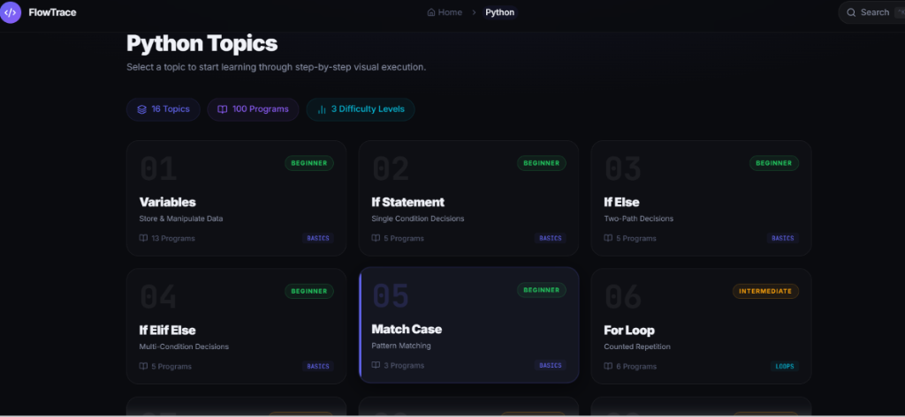
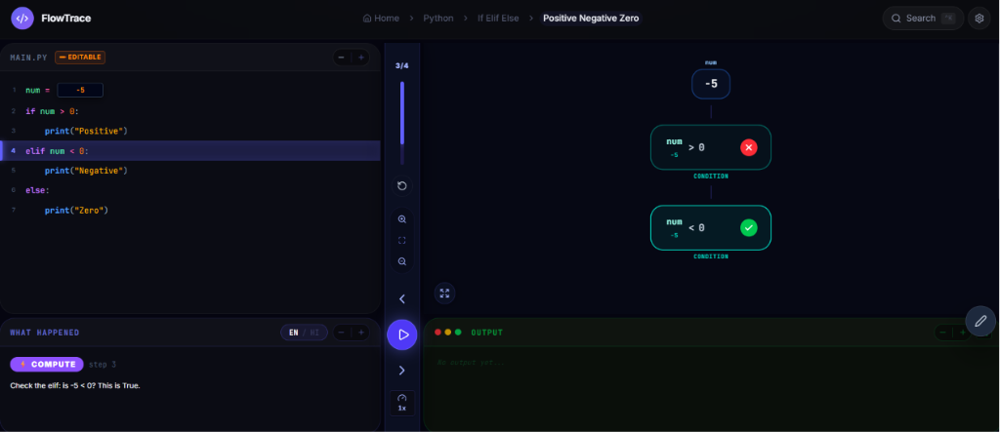

# FlowTrace 🚀

Ever stared at a block of code, wishing you could shrink down and watch exactly how the computer steps through it? FlowTrace is built to do just that. It translates abstract, dry logic into a living, breathing canvas where variables, conditions, loops, and data structures come alive in real-time.

  
  &nbsp;
  

> [!IMPORTANT]
> **📢 Project Notice & Status:**
> * **Beta Version:** FlowTrace is currently in **Beta** and under active development.
> * **Python Only:** Currently, only **Python** code visualization is supported.
> * **PC / Desktop Optimized:** The interface is fully optimized for **PC and Desktop screens** to accommodate the extensive multi-panel timeline layouts. Responsive design for mobile screens is currently under development.

---

## 💡 The Problem We Solve

When people start learning programming, they are often forced to look at static print statements or use complex, dry debuggers. This requires a lot of mental work to keep track of indices, pointers, and memory state. 

**FlowTrace solves this by turning code execution into a step-by-step visual story.** 
No more guessing:
* **"Where is the loop right now?"** You can see the loop block light up and watch the variables change.
* **"How does index slicing actually work?"** You can watch the selection box glide over lists element-by-element.
* **"How does the local scope look inside a function?"** The interface dims the main code and lights up the active local scope, keeping your mind focused.

---

## ✨ Innovation & Design Features

We designed this app to feel premium, cinematic, and incredibly satisfying to use:

### 🎬 Cinematic Focus & Dimming
To keep you from getting lost in larger code blocks, FlowTrace uses smart focus-dimming. The moment execution enters a function or a nested loop, the rest of the workspace scales down, blurs, and fades to the background, drawing your attention entirely to the active step.

### ✏️ Real-Time Inline Code Editing
You don't just watch pre-made code. You can click on variables, indices, and values directly inside the code editor and change them. Want to see what happens to a loop when the limit is `15` instead of `5`? Or if you update index `0` instead of `1`? Type it in, click Apply, and watch the visual steps recalculate instantly.

### 🧪 Micro-Animations & Dynamic Math Blocks
* **Mathematical Operations:** Calculations aren't just updated silently. Input blocks glide together, apply operators, and merge into the destination variable with a soft amber glow.
* **String Waves:** Watch `.upper()` or `.lower()` transformations ripple character-by-character across string blocks.
* **Size Tracking:** The `len()` function cycles through characters or list cells one-by-one, highlighting them as it counts.

### 🍇 Premium Purple List Box Grid
List and array data structures are rendered as horizontal partitions wrapped in a premium purple theme. Each cell clearly embeds its index position in the top-left, making list updates, traversals, and swaps extremely satisfying to watch.

---

## 🎒 Current Availability

FlowTrace currently features interactive visual flows for the following programming topics:

| Topic Area | What You Can Visualize |
| :--- | :--- |
| **Variables & Memory** | Declarations, updates, and value copying. |
| **Conditionals** | `if`, `elif`, `else` branch evaluations showing matching/failing paths. |
| **Loops** | `for` and `while` loop controls, nested structures, and loop breaks. |
| **Strings** | String length counting, reversals, case transformations, palindromes, vowel/consonant filters. |
| **Lists & Tuples** | Creating arrays, accessing elements, index updates (`numbers[idx] = val`), and list traversals. |
| **Dictionaries** | Key-value store allocations and real-time retrievals. |
| **Functions & Recursion** | Call stacks, parameter passing, return values, and step-by-step local memory persistence. |

---

## 🚀 How to Experience it

1. **Select a Topic:** Choose from the sidebar options (Variables, Strings, Lists, Functions, etc.).
2. **Play the Execution:** Use the playback panel at the bottom to step forward, step backward, or auto-run the visualizer.
3. **Interact and Edit:** Double-click highlighted values directly inside the code view to change variables, and watch the entire visualization rebuild itself around your changes!
